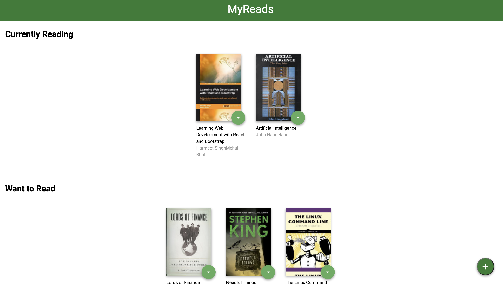
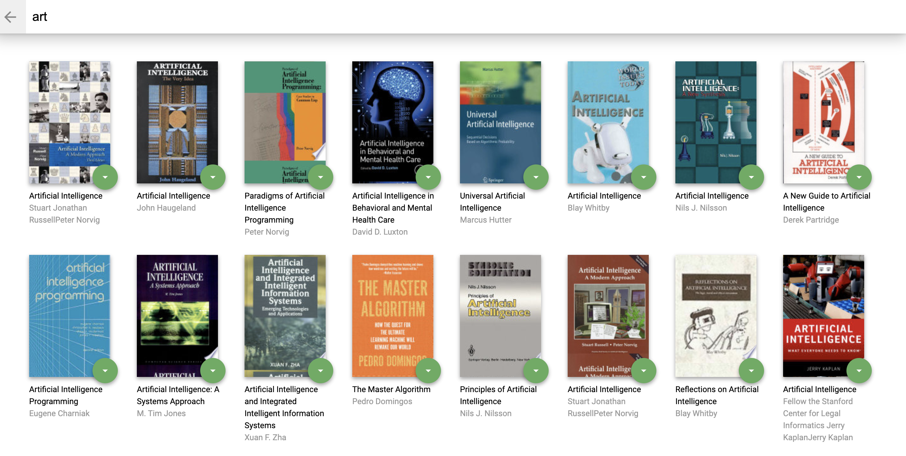

# MyReads

MyReads is a simple app that allows you to place books in one of three shelves or categories.

- Currently Reading
- Want to Read
- Read

It also allow you to search for books based on title and author.

This app is the project required for [Udacity's React Nanodegree program](https://www.udacity.com/course/react-nanodegree--nd019).


## Installation

Clone the repository, change directories, and use NPM to install the dependencies.

```bash
$ git clone https://github.com/ishantgit/MyReads
$ cd MyReads
$ npm install
```

## Usage

The project can be run with

- `npm start`

The project can be viewed in the browser at

- [http://localhost:3000](http://localhost:3000)

## Screenshots



